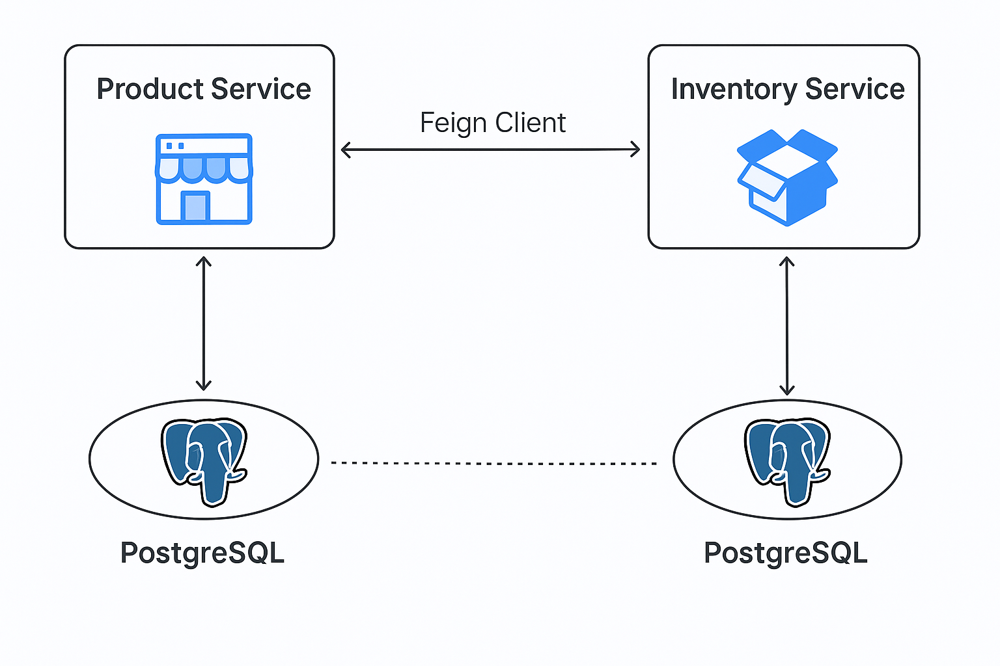

# 🧩 Microservices Project: Product & Inventory Service

Este proyecto demuestra la arquitectura y comunicación entre dos microservicios implementados con Spring Boot, utilizando **Docker**, **OpenFeign**, **Spring Data JPA** y orquestados mediante **Docker Compose**.

---

## 📦 Microservicios

### 🛒 Product Service
- Gestión de productos.
- Expone una API RESTful para crear y consultar productos.
- Puerto por defecto: `8081`.

### 📦 Inventory Service
- Gestión de stock por producto.
- Se comunica con el Product Service mediante **OpenFeign**.
- Puerto por defecto: `8082`.

---

## 🚀 Instalación y Ejecución

### ⚙️ Requisitos

- Docker
- Docker Compose
- Git

### 🐳 Iniciar los servicios

```bash
git clone https://github.com/Martinfbr/microservices-project.git
cd microservices-project
docker-compose up --build


Esto ejecutará ambos servicios y una base de datos PostgreSQL para persistencia.

🔥 Verificación
Product API: http://localhost:8081/api/v1/products

Inventory API: http://localhost:8082/api/v1/inventory

Puedes usar Postman o Swagger para probar los endpoints.

| Tecnología          | Uso                              |
| ------------------- | -------------------------------- |
| Spring Boot         | Base de los microservicios       |
| Spring Data JPA     | Acceso a datos con PostgreSQL    |
| OpenFeign           | Comunicación entre servicios     |
| Docker              | Contenerización de servicios     |
| Docker Compose      | Orquestación de microservicios   |
| PostgreSQL          | Base de datos                    |
| Swagger / SpringDoc | Documentación automática de APIs |


🧠 Decisiones Técnicas
Feign Client para desacoplar la comunicación entre servicios.

DockerCompose para ejecutar todos los servicios localmente con un solo comando.

PostgreSQL como base de datos para ambientes productivos.

Uso de perfiles dev y prod para permitir configuraciones distintas por entorno.

Separación por capas: Controller, Service, Repository.


🔍 Documentación de API
Cada servicio incluye documentación Swagger:

Product: http://localhost:8081/swagger-ui.html

Inventory: http://localhost:8082/swagger-ui.html


📁 Estructura del Proyecto

microservices-project/
├── docker-compose.yml
├── product-service/
│   ├── Dockerfile
│   └── src/
├── inventory-service/
│   ├── Dockerfile
│   └── src/
└── README.md

## 🧭 Diagrama de Arquitectura

